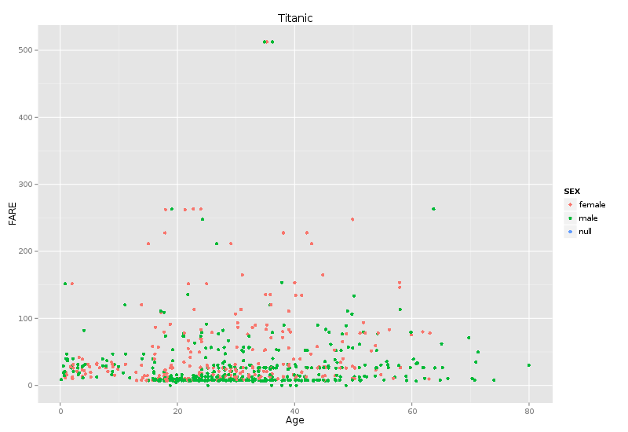
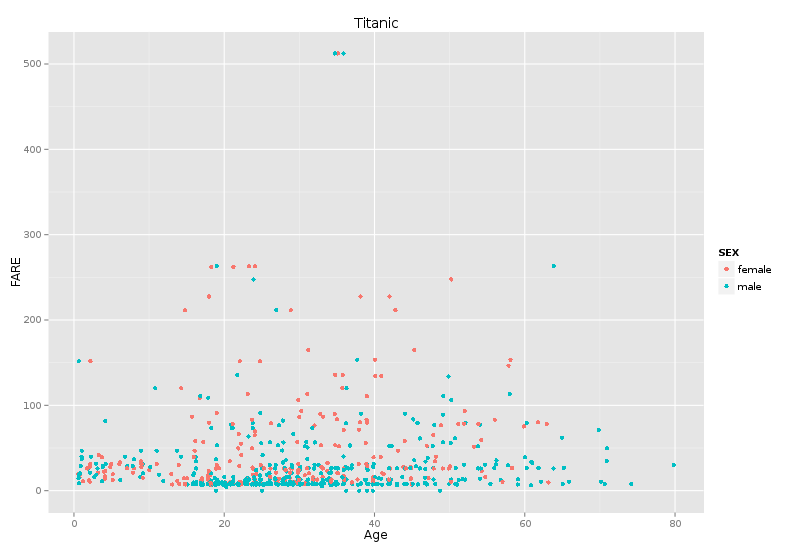
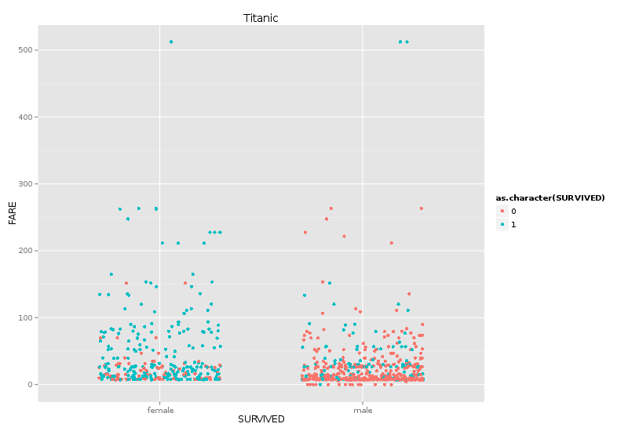
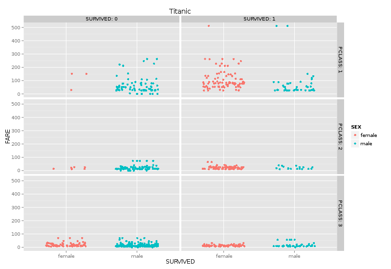
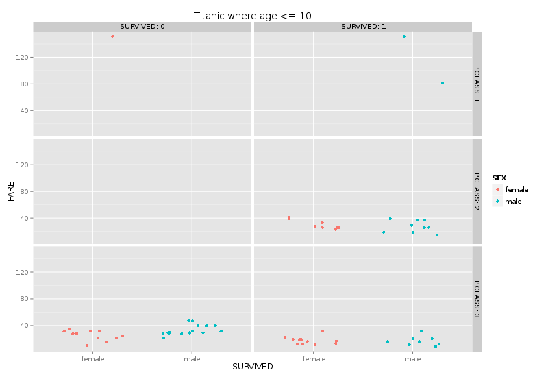
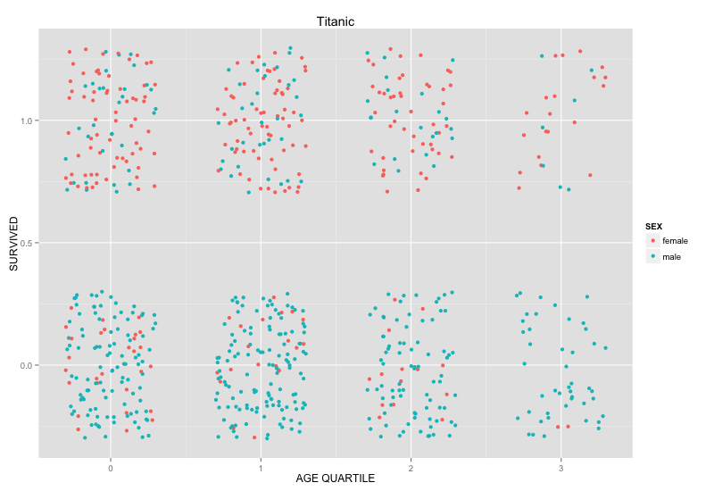

Plot1:

Plot 2:

Plot3:

Plot4:

Plot5:



Summary:
```{r echo=FALSE}
df <- read.csv("./../01\ Data/titanic_sex_age.csv")
summary(df)
```
Subset:
```{r echo=FALSE}
head(df)
```

For our unique plot, we wanted to visualize the age of survivors grouped in to quartiles. We wanted to do this with facets for quartiles. This data is not part of the dataset, so there was some data cleanup and wrangling we had to do first.

```{r echo=TRUE}
#first, we had to clean out the data with no ages
df <- df[df$AGE!='null' ,]

#now we calculate the quartiles

summary(as.numeric(df$AGE))


#and put them in their own vector
ageRange <- c()

for (i in 1:length(df$AGE)) {
  #the ages got interpreted as characters, so we had to convert them to numbers
  age <- as.numeric(as.character(df$AGE))[i]
  if(age<=22)
    ageRange<-c(ageRange,0)
  if(age>22 && age <= 34)
    ageRange<-c(ageRange,1)
  if(age>34 && age <= 49)
    ageRange<-c(ageRange,2)
  if(age>49)
    ageRange<-c(ageRange,3)
}

#FINALLY, we can put it back in the data frame
df <- data.frame(df,ageRange)

```

Finally, we initially tried using a facet to represent the quartiles and plot age vs survivorship within each grid. However, we quickly discover that this visualization didn't really buy us anything new. Instead we did a more straightforward graph of quartile vs survivorship. We were hoping to discover  that some age quartiles had differing rates of mortality, but survival ended up looking pretty even.

Unique Plot:


