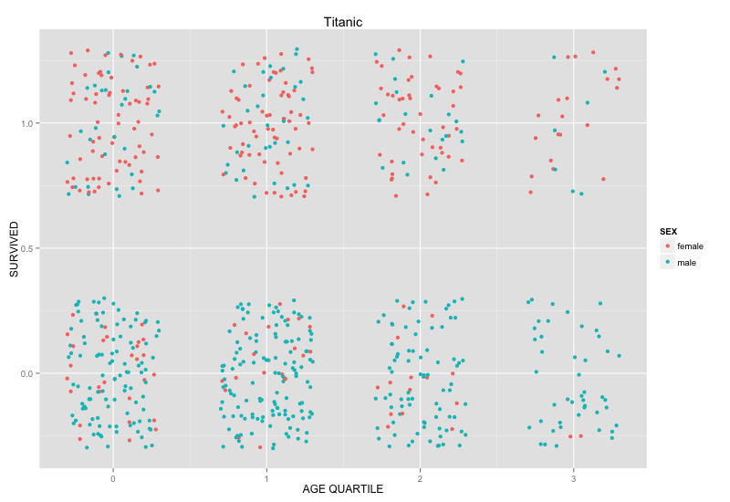

Plot1:

Plot 2:

Plot3:

Plot4:

Plot5:

Unique Plot:


Summary:

```
##        X          PASSENGERID       SURVIVED          PCLASS     
##  Min.   : 1.00   Min.   :  8.0   Min.   :0.0000   Min.   :1.000  
##  1st Qu.:16.75   1st Qu.:183.8   1st Qu.:0.0000   1st Qu.:2.000  
##  Median :32.50   Median :414.0   Median :1.0000   Median :3.000  
##  Mean   :32.50   Mean   :430.8   Mean   :0.5938   Mean   :2.641  
##  3rd Qu.:48.25   3rd Qu.:699.2   3rd Qu.:1.0000   3rd Qu.:3.000  
##  Max.   :64.00   Max.   :870.0   Max.   :1.0000   Max.   :3.000  
##                                                                  
##                                       NAME        SEX          AGE        
##  Allison, Master. Hudson Trevor         : 1   female:31   Min.   : 0.420  
##  Allison, Miss. Helen Loraine           : 1   male  :33   1st Qu.: 2.000  
##  Andersson, Master. Sigvard Harald Elias: 1               Median : 4.000  
##  Andersson, Miss. Ebba Iris Alfrida     : 1               Mean   : 4.268  
##  Andersson, Miss. Ellis Anna Maria      : 1               3rd Qu.: 7.000  
##  Andersson, Miss. Ingeborg Constanzia   : 1               Max.   :10.000  
##  (Other)                                :58                               
##      SIBSP           PARCH           TICKET        FARE        
##  Min.   :0.000   Min.   :0.000   347082 : 4   Min.   :  8.517  
##  1st Qu.:0.750   1st Qu.:1.000   347088 : 4   1st Qu.: 19.131  
##  Median :1.000   Median :1.000   382652 : 4   Median : 27.000  
##  Mean   :1.844   Mean   :1.422   2666   : 3   Mean   : 30.434  
##  3rd Qu.:3.250   3rd Qu.:2.000   3101295: 3   3rd Qu.: 31.387  
##  Max.   :5.000   Max.   :2.000   347077 : 3   Max.   :151.550  
##                                  (Other):43                    
##      CABIN    EMBARKED
##  A34    : 1   C: 9    
##  C22 C26: 2   Q: 4    
##  E121   : 1   S:51    
##  F2     : 2           
##  F4     : 2           
##  G6     : 2           
##  null   :54
```
Subset:

```
##   X PASSENGERID SURVIVED PCLASS                                     NAME
## 1 1           8        0      3           Palsson, Master. Gosta Leonard
## 2 2          11        1      3          Sandstrom, Miss. Marguerite Rut
## 3 3          17        0      3                     Rice, Master. Eugene
## 4 4          25        0      3            Palsson, Miss. Torborg Danira
## 5 5          44        1      2 Laroche, Miss. Simonne Marie Anne Andree
## 6 6          51        0      3               Panula, Master. Juha Niilo
##      SEX AGE SIBSP PARCH        TICKET    FARE CABIN EMBARKED
## 1   male   2     3     1        349909 21.0750  null        S
## 2 female   4     1     1       PP 9549 16.7000    G6        S
## 3   male   2     4     1        382652 29.1250  null        Q
## 4 female   8     3     1        349909 21.0750  null        S
## 5 female   3     1     2 SC/Paris 2123 41.5792  null        C
## 6   male   7     4     1       3101295 39.6875  null        S
```

