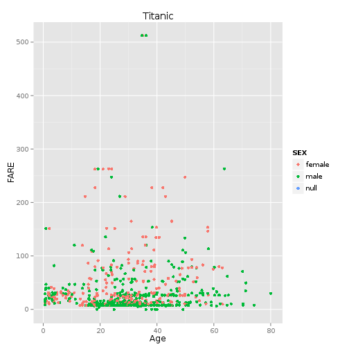
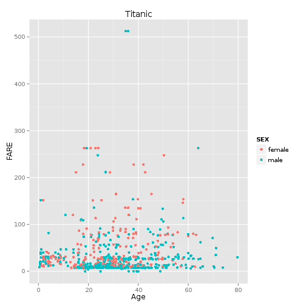
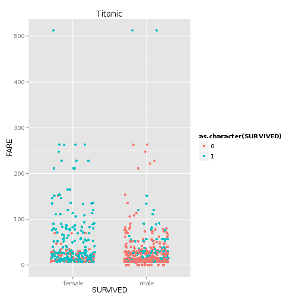
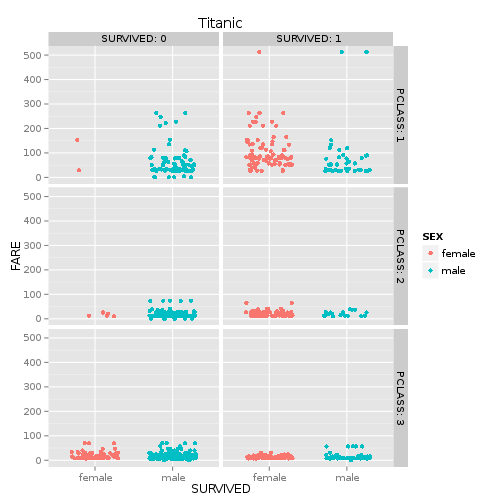
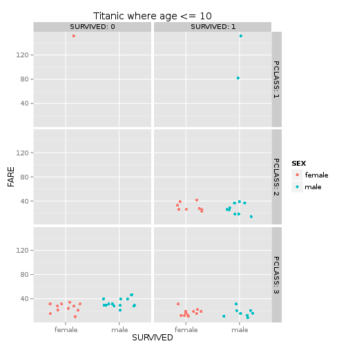
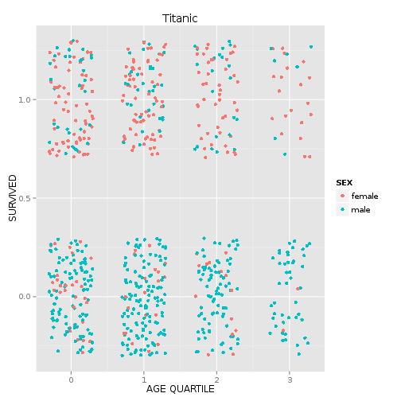

# Project 1 Documentation

## Querying the Data:

The first step in the project was accessing the data. In terms of querying the dataset, we decided to insulate ourselves from any database failure. Once we queried the database, we exported the datasets to a CSV. The following queries are what we ran to gather the data.

```
#Plot 1
SELECT  * FROM titanic;

#Plot 2
SELECT * FROM titanic WHERE sex IS NOT NULL;

#Plot 3
SELECT * FROM titanic WHERE sex IS NOT NULL;

#Plot 4
SELECT * FROM titanic WHERE sex IS NOT NULL;

#Plot 5
SELECT * FROM titanic WHERE sex IS NOT NULL AND age <= 10;


```

Each of the three subsets we used were given their own csv file.

--------------


## Plot 1:

The first plot makes use of the entire Titanic dataset, including those passengers whose sex was marked null. We used a point plot on a cartesian coordinate systems, plotting passenger age on the x-axis vs. the fare the passenger paid on the y-axis, and separated the points into colors based on sex.

At a glance the plot suggests that there is no real correlation between age and fare, though the plot does seem to indicate that females may have paid a higher fare, on average, than men.

```r
source("../02\ Visualizations/plot1.R", echo= TRUE)
```

```
## 
## > df <- read.csv("../01\ Data/titanic.csv")
## 
## > require(extrafont)
## 
## > ggplot() +
## +     coord_cartesian() +
## +     scale_x_continuous() +
## +     scale_y_continuous() +
## +     labs(title='Titanic') +
## +     labs(x="Age", y=p .... [TRUNCATED]
```

```
## Warning: NAs introduced by coercion
```

```
## Warning: NAs introduced by coercion
```

```
## Warning: Removed 179 rows containing missing values (geom_point).
```

 
--------------

## Plot 2:
This plot was generated in the same manner as Plot 1, with the exception of using only passengers from the dataset whose sex was not listed as "null." With regards to analysis, this plot is ultimately no different than Plot 1, and thus provides no new interesting information.

```r
source("../02\ Visualizations/plot2.R", echo= TRUE)
```

```
## 
## > df <- read.csv("../01\ Data/titanic_sex.csv")
## 
## > require(extrafont)
## 
## > ggplot() +
## +     coord_cartesian() +
## +     scale_x_continuous() +
## +     scale_y_continuous() +
## +     labs(title='Titanic') +
## +     labs(x="Age", y=p .... [TRUNCATED]
```

```
## Warning: NAs introduced by coercion
```

```
## Warning: Removed 177 rows containing missing values (geom_point).
```

 

--------------

## Plot 3:
This plot uses the same subset as Plot 2; that is, it excludes passengers with "null" sex. We plotted the data using a cartesian coordinate system, this time using a discrete x-axis in order to plot sex. The y-axis represents the passenger fare, and we colored the points based on whether or not the passenger survived.

This plot makes it quite clear that a given female passenger on board would be far more likely to survive than a male passenger. It is not particularly clear from this plot whether or not passenger fares had a significant impact in determining passenger survival or not.

```r
source("../02\ Visualizations/plot3.R", echo= TRUE)
```

```
## 
## > df <- read.csv("../01\ Data/titanic_sex.csv")
## 
## > require(extrafont)
## 
## > ggplot() +
## +     coord_cartesian() +
## +     scale_x_discrete() +
## +     scale_y_continuous() +
## +     labs(title='Titanic') +
## +     labs(x="SURVIVED",  .... [TRUNCATED]
```

 

--------------

## Plot 4:
This plot uses the subset which excludes passengers with null sex. We created a grid of six plots that splits up the data into two columns based on whether or not the passenger survived, and into three rows based on which of the three classes the passenger was in. We used the x-axis for passenger sex, and the y-axis for passenger fare, while also using separate colors for each sex for good measure.

This plot provides for a wealth of interesting analysis. While Plot 3 showed that female passengers were more likely to survive than male passengers, this plot lets us see how that relationship depends on passenger class. For example, the relationship holds very well for first and second-class passengers. Nearly every first and second class passenger who died was male. On the other hand, the relationship doesnt hold nearly as well for third-class passengers. It appears that male and female third-class passengers had roughly equal odds of survival.

The plot also reveals a clear correlation between passenger class and survival rates. In general, it appears that the upper-class passengers tended to have better survival rates than lower class passengers.

The data also shows the obvious, that upper-class passengers tended to pay higher fares than lower-class passengers

```r
source("../02\ Visualizations/plot4.R", echo= TRUE)
```

```
## 
## > df <- read.csv("../01\ Data/titanic_sex.csv")
## 
## > require(extrafont)
## 
## > ggplot() +
## +     coord_cartesian() +
## +     scale_x_discrete() +
## +     scale_y_continuous() +
## +     facet_grid(PCLASS~SURVIVED,labeller=label_both) + .... [TRUNCATED]
```

 

--------------

## Plot 5:
This plot was generated in exactly the same manner as Plot 4, using a different dataset. For this plot, we restricted ourselves to passengers whose ages were less than 10.

Particularly for the upper-class passengers, there really isn't enough data to draw too many strong conclusions, however it is clear that first and second-class passengers had very good rates of survival. on the other hand, third-class children did not share the same fortune. Comparing with Plot 4, it appears that their survival rates were roughly on par with their older third-class counterparts.

```r
source("../02\ Visualizations/plot5.R", echo= TRUE)
```

```
## 
## > df <- read.csv("../01\ Data/titanic_sex_age.csv")
## 
## > require(extrafont)
## 
## > ggplot() +
## +     coord_cartesian() +
## +     scale_x_discrete() +
## +     scale_y_continuous() +
## +     facet_grid(PCLASS~SURVIVED,labeller=label_both) + .... [TRUNCATED]
```

 


--------------


## Summary:
Here is a summary of the complete dataset.

```
##        X          PASSENGERID       SURVIVED          PCLASS     
##  Min.   : 1.00   Min.   :  8.0   Min.   :0.0000   Min.   :1.000  
##  1st Qu.:16.75   1st Qu.:183.8   1st Qu.:0.0000   1st Qu.:2.000  
##  Median :32.50   Median :414.0   Median :1.0000   Median :3.000  
##  Mean   :32.50   Mean   :430.8   Mean   :0.5938   Mean   :2.641  
##  3rd Qu.:48.25   3rd Qu.:699.2   3rd Qu.:1.0000   3rd Qu.:3.000  
##  Max.   :64.00   Max.   :870.0   Max.   :1.0000   Max.   :3.000  
##                                                                  
##                                       NAME        SEX          AGE        
##  Allison, Master. Hudson Trevor         : 1   female:31   Min.   : 0.420  
##  Allison, Miss. Helen Loraine           : 1   male  :33   1st Qu.: 2.000  
##  Andersson, Master. Sigvard Harald Elias: 1               Median : 4.000  
##  Andersson, Miss. Ebba Iris Alfrida     : 1               Mean   : 4.268  
##  Andersson, Miss. Ellis Anna Maria      : 1               3rd Qu.: 7.000  
##  Andersson, Miss. Ingeborg Constanzia   : 1               Max.   :10.000  
##  (Other)                                :58                               
##      SIBSP           PARCH           TICKET        FARE        
##  Min.   :0.000   Min.   :0.000   347082 : 4   Min.   :  8.517  
##  1st Qu.:0.750   1st Qu.:1.000   347088 : 4   1st Qu.: 19.131  
##  Median :1.000   Median :1.000   382652 : 4   Median : 27.000  
##  Mean   :1.844   Mean   :1.422   2666   : 3   Mean   : 30.434  
##  3rd Qu.:3.250   3rd Qu.:2.000   3101295: 3   3rd Qu.: 31.387  
##  Max.   :5.000   Max.   :2.000   347077 : 3   Max.   :151.550  
##                                  (Other):43                    
##      CABIN    EMBARKED
##  A34    : 1   C: 9    
##  C22 C26: 2   Q: 4    
##  E121   : 1   S:51    
##  F2     : 2           
##  F4     : 2           
##  G6     : 2           
##  null   :54
```
## Subset:
Here are a few rows of data taken from the head of the dataset.

```
##   X PASSENGERID SURVIVED PCLASS                                     NAME
## 1 1           8        0      3           Palsson, Master. Gosta Leonard
## 2 2          11        1      3          Sandstrom, Miss. Marguerite Rut
## 3 3          17        0      3                     Rice, Master. Eugene
## 4 4          25        0      3            Palsson, Miss. Torborg Danira
## 5 5          44        1      2 Laroche, Miss. Simonne Marie Anne Andree
## 6 6          51        0      3               Panula, Master. Juha Niilo
##      SEX AGE SIBSP PARCH        TICKET    FARE CABIN EMBARKED
## 1   male   2     3     1        349909 21.0750  null        S
## 2 female   4     1     1       PP 9549 16.7000    G6        S
## 3   male   2     4     1        382652 29.1250  null        Q
## 4 female   8     3     1        349909 21.0750  null        S
## 5 female   3     1     2 SC/Paris 2123 41.5792  null        C
## 6   male   7     4     1       3101295 39.6875  null        S
```

--------------

## Plot 6:
For our unique plot, we wanted to visualize the age of survivors grouped in to quartiles. We wanted to do this with facets for quartiles. This data is not part of the dataset, so there was some data cleanup and wrangling we had to do first.


```r
#first, we had to clean out the data with no ages
df <- df[df$AGE!='null' ,]

#now we calculate the quartiles

summary(as.numeric(df$AGE))
```

```
##    Min. 1st Qu.  Median    Mean 3rd Qu.    Max. 
##   0.420   2.000   4.000   4.268   7.000  10.000
```

```r
#and put them in their own vector
ageRange <- c()

for (i in 1:length(df$AGE)) {
  #the ages got interpreted as characters, so we had to convert them to numbers
  age <- as.numeric(as.character(df$AGE))[i]
  if(age<=22)
    ageRange<-c(ageRange,0)
  if(age>22 && age <= 34)
    ageRange<-c(ageRange,1)
  if(age>34 && age <= 49)
    ageRange<-c(ageRange,2)
  if(age>49)
    ageRange<-c(ageRange,3)
}

#FINALLY, we can put it back in the data frame
df <- data.frame(df,ageRange)
```

Finally, we initially tried using a facet to represent the quartiles and plot age vs survivorship within each grid. However, we quickly discover that this visualization didn't really buy us anything new. Instead we did a more straightforward graph of quartile vs survivorship. We were hoping to discover  that some age quartiles had differing rates of mortality, but survival ended up looking pretty even.

Unique Plot:

```r
source("../02\ Visualizations/newplot.R", echo= TRUE)
```

```
## 
## > df <- read.csv("../01\ Data/titanic_sex.csv")
## 
## > df <- df[df$AGE!='null' ,]
## 
## > summary(as.numeric(df$AGE))
##    Min. 1st Qu.  Median    Mean 3rd Qu.    Max. 
##    1.00   22.00   34.00   37.14   49.00   88.00 
## 
## > ageRange <- c()
## 
## > for (i in 1:length(df$AGE)) {
## +   age <- as.numeric(as.character(df$AGE))[i]
## + 
## +   
## +   if(age<=22)
## +     ageRange<-c(ageRange,0)
## +   if(age>22 &&  .... [TRUNCATED] 
## 
## > df <- data.frame(df,ageRange)
## 
## > require(extrafont)
## 
## > ggplot() +
## +     coord_cartesian() +
## +     scale_x_continuous() +
## +     scale_y_continuous() +
## +     labs(title='Titanic') +
## +     labs(y="SURVIVED" .... [TRUNCATED]
```

 

